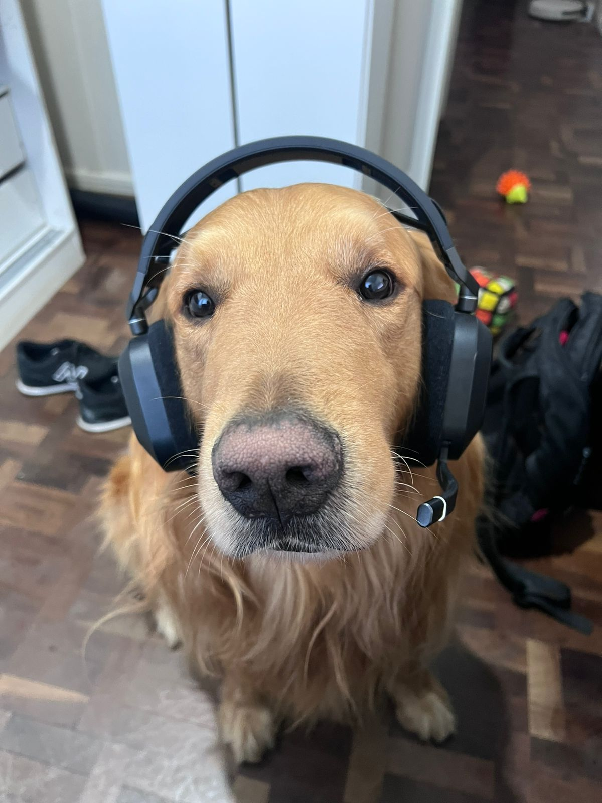

  

<h1 align="center"> Sistema de Gerenciamento de Pizzaria</h1>

  Projeto Integrador • CRUD Completo  
   
  Desenvolvido em PHP, Bootstrap e MySQL

  
  
  
  

---

##  Tecnologias Utilizadas

- **PHP 8+** — Backend
- **MySQL** — Banco de dados relacional
- **Bootstrap 5** — Layout responsivo
- **HTML5 / CSS3 / JavaScript**
- **XAMPP / Laragon / WAMP** — Ambiente local

---

